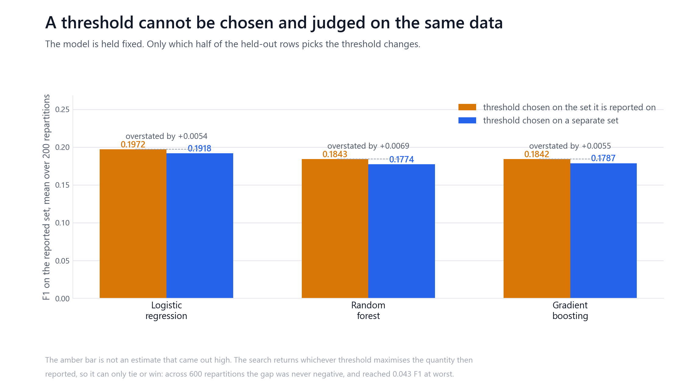
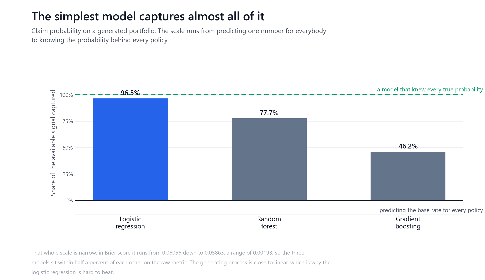
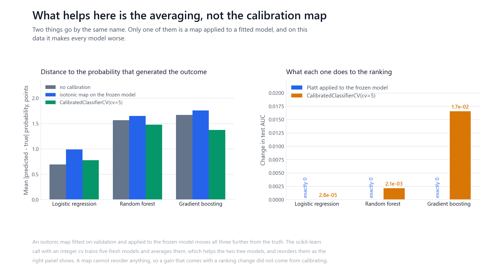
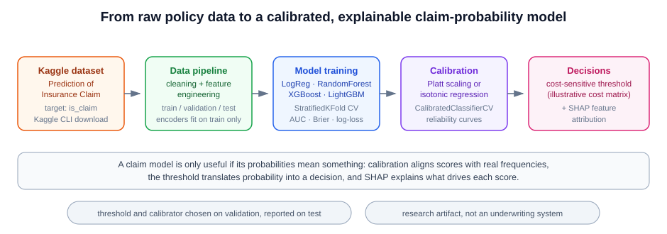

# Insurance claims prediction

Predicting whether a policy files a claim is the easy half. The probabilities have
to mean something, somebody has to pick the point at which a number becomes a
decision, and both of those are choices made by looking at labels. This repository
is about where those choices are allowed to happen.

It began as a pipeline for a Kaggle claims dataset. Its README said, correctly,
that calibration and threshold selection belong on a validation set separate from
the final test set. Its code did neither. That has been fixed, and the cost of the
original arrangement measured.

> **Research prototype.** No insurance data is included and none was used to
> produce any number here. Every result comes from a portfolio this repository
> generates. Nothing here is an actuarial finding, and none of it should be used
> to price, underwrite, or decide anything about a real person or policy.



## The defect

Two functions made a decision on the test set and then reported a score on that
same test set.

`run_threshold_optimization` searched ninety-nine thresholds against the test
labels, kept the best, and printed the metrics at it. `run_calibration` fitted
Platt scaling and isotonic regression, compared their Brier scores on the test set,
and kept the winner. There was no validation split in the pipeline to do either
one honestly with.

This is not a model trained on test data. The models were trained correctly, which
is why an audit of the training path finds nothing. It is two scalars chosen on the
data they are graded against, and the effect has a property that makes it worse
than an ordinary bias: **it can never point the other way.** A search returns
whichever threshold maximises the quantity being reported, so choosing on the
scoring set ties or wins, never loses. In 600 repartitions run here the gap was
zero or positive every time. A number produced that way is an upper bound
presented as an estimate.

| Model | F1, threshold chosen on the reported set | Chosen on a separate set | Overstated by |
| --- | --- | --- | --- |
| Logistic regression | 0.1972 | 0.1918 | +0.0054 |
| Random forest | 0.1843 | 0.1774 | +0.0069 |
| Gradient boosting | 0.1842 | 0.1787 | +0.0055 |

Under the repository's illustrative cost matrix the same comparison runs from
+1,662 to +6,310 units of business value. Those means understate the risk to any
one report: on individual splits the F1 gap reached 0.043, and the two choices
happened to coincide on between 6 and 44 percent of splits, which is how the
practice survives casual checking.

Calibrator selection moved too. On gradient boosting, the test set preferred
isotonic and validation preferred Platt, so the original code would have shipped a
different calibrator than an honest procedure chooses.

## What was changed

`src/data_pipeline.py` now produces a three-way split, and returns named parts
rather than a tuple, because there are three of them and confusing two is the
failure the split exists to prevent. `run_calibration` and
`run_threshold_optimization` select on validation and report on test, and both
refuse to run against a two-way split rather than silently falling back.
`tests/test_selection_path.py` exercises all four of those behaviours.

Three smaller defects surfaced on the way. `src/explainability.py` imported `shap`
at module scope, so the file could not be imported at all without an optional
dependency. Several functions took `save_dir: Path = RESULTS_DIR`, which binds
once at import and cannot be redirected. And the loaded `.npz` archives were never
closed.

Changing that return type then broke the script that feeds everything else.
`run_pipeline` is the only caller that writes `results/processed_data.npz`, which
`run_calibration`, `run_threshold_optimization`, `src/explainability.py` and
`src/model_training.py` all read, and it still unpacked the five names
`encode_and_split` used to return. `python -m src.data_pipeline` raised before it
wrote anything, and past that it saved four of the six arrays, so the validation
split would have been missing and both entry points would have refused, printing
a message that tells the reader to rerun the script that could not run.

The existing tests could not have caught it, because they build that archive
themselves with `np.savez`. They proved the consumers work on an archive of the
right shape without asking whether the producer writes one.
`tests/test_pipeline_handoff.py` drives the real producer into the real
consumers.

One more, in a module that produces no number here: every Brier score
`src/model_training.py` printed was `nan`. `make_scorer` took `needs_proba` until
scikit-learn removed it, and now forwards an unrecognised keyword to the metric,
so the scorer raised on every fold, `cross_validate` replaced each score with
`nan`, and a blanket `warnings.filterwarnings("ignore")` at the top of the file
swallowed the explanation. The same line was in the second notebook.

## The data

`src.synthetic_portfolio` generates 40,000 policies with nine features, at a claim
rate of 6.47 percent. It computes each policy's true claim probability from a
stated formula and then draws the outcome from it.

That is the point of generating rather than downloading. Calibration is a claim
about predicted probabilities matching true ones, and on real data a single
policy's true probability is never observable, so calibration can only be checked
against frequencies in bins. Here the generating probability is recorded next to
the outcome. A prediction can be compared with the quantity it estimates, and the
best attainable score is computable rather than assumed.

The column holding it is never a feature. Admitting it would score exactly at the
floor below, which `tests/test_leakage.py` both demonstrates and forbids.

## How much is there to win



Predicting the base rate for every policy scores a Brier of 0.06056. A model that
knew every true probability scores 0.05863. Everything a model can possibly
contribute lives in that gap of 0.00193, about three percent of the score.

| Model | Brier | Share of the available signal | AUC |
| --- | --- | --- | --- |
| Logistic regression | 0.05870 | 96.5% | 0.6922 |
| Random forest | 0.05906 | 77.7% | 0.6764 |
| Gradient boosting | 0.05967 | 46.2% | 0.6608 |

The logistic regression wins, and not narrowly. The outcomes were generated from a
mostly linear log-odds function, so this says more about the generator than about
insurance, and it is reported that way. What it does show is the shape of the
problem: on a rare, noisy binary outcome the whole contest is decided inside the
third decimal place, and a raw Brier score of 0.059 is meaningless without the
0.05863 next to it.

Accuracy is worse than meaningless here. Never predicting a claim is 93.53 percent
accurate and has no content at all.

## What calibration actually does



Two different operations go by the name calibration, and only one of them is a map
applied to a fitted model.

Fitting an isotonic or Platt map on validation and applying it to the frozen model
moved all three models **further** from the true probabilities on this data. The
logistic regression was already close to calibrated, and correcting a calibrated
model adds variance for nothing.

`CalibratedClassifierCV` with an integer `cv` is a different object. It trains five
fresh models and averages them, and that helped the two tree models. It also
changed their ranking, by 0.00215 AUC for the random forest and 0.01655 for
gradient boosting, while the frozen map changed AUC by exactly 0.0 for all three.
A monotone map cannot reorder anything, so a gain that arrives together with a
ranking change did not come from calibrating. It came from the ensembling.

This matters for reading a result: "calibration improved our Brier score by x
percent" is two claims wearing one label, and only the frozen form supports the
usual accompanying statement that ranking is unaffected.

## Does the model earn its complexity

On this data, no. The logistic regression captures 96.5 percent of the available
signal and both ensembles capture less. Under the illustrative cost matrix, the
alternatives a decision rule competes against are:

| Rule | Business value on the test set |
| --- | --- |
| Never flag a policy | -518,000 |
| Flag every policy | -115,100 |
| Best rule on the true probabilities | -82,150 |
| Logistic regression, threshold from validation | -101,368 |

The model recovers about 42 percent of the distance between flagging everything
and the best rule available. The cost matrix is illustrative and is not a validated
business policy, so that percentage describes the arithmetic, not a business case.

## Reproducing

```bash
pip install -r requirements.txt

python -m src.synthetic_portfolio                # what the generated portfolio is
python -m src.benchmark                          # writes results/benchmark.json
python -m unittest discover -s tests             # 35 tests
python scripts/figures/generate_figures.py       # writes docs/figures/
python scripts/check_repository.py               # README against the recorded results
python scripts/check_reproducibility.py          # rerun, and check the findings survive
```

No data download and no Kaggle credentials. Every number in this README is read
from `results/benchmark.json`, and so is every number drawn on the three figures,
which record what they were read from inside the files themselves.
`scripts/check_repository.py` fails if either stops agreeing with the results, or
if the test count above stops matching what discovery finds.

No GPU either, and that is a conclusion rather than an omission. scikit-learn is
CPU-only and has no Intel XPU backend, so the accelerator on the machine these
results come from cannot be reached at all, and the optional xgboost build offers
CUDA and nothing else. The workload would not repay one in any case: the design
matrix is a few megabytes, every model fits in seconds, and most of the running
time goes on a Python loop calling `f1_score` once per threshold per repartition,
which is interpreter overhead rather than arithmetic.

The original Kaggle path still exists. `src/data_pipeline.py --download` needs
credentials and acceptance of that dataset's terms, and produces no number in this
README.

## Limitations

The portfolio is generated. Its relationships were written in
`src/synthetic_portfolio.py`, so every absolute number here describes that file.
What transfers is the structure of the argument, not the values.

The generating log-odds is mostly linear, which is why the logistic regression
wins. On a portfolio with strong interactions the ranking would differ. This is not
evidence that linear models beat ensembles on claims data.

The threshold study holds the model fixed and repartitions the held-out rows. It
measures selection optimism, not the additional variance from refitting.

The cost matrix is the repository's original illustrative one. It has not been
reviewed against any domain, legal, or fairness standard, and the fairness of the
resulting decisions is not examined anywhere in this repository.

One seed per model. There is no hyperparameter search, so this compares
configurations rather than tuned models.

## What is exploratory

`src/model_training.py` and `src/explainability.py` produce no number in this
README. Continuous integration compiles them and the smoke test exercises the
preprocessing path, but nothing checks their outputs. `src/explainability.py`
needs SHAP, which is optional and not installed in the environment these results
come from, so it has not been run here.

The two notebooks have never been run here, and no longer run anywhere. Not one
cell in either carries an execution count or an output. They do not import the
pipeline either: each defines its own generator, with its own columns and its own
name for the target, so what they would print describes neither
`src/synthetic_portfolio.py` nor any insurance data. Executed against currently
installable versions of what they import, cells in both raise, at a seaborn
palette call in the first and at a shap plotting call in the second whose
signature has changed. They are kept as the record of where this repository
started, and running them needs the extras in `requirements-optional.txt`.

<p align="center">
  
</p>

## Data source

The original target was Kaggle's
[Prediction of Insurance Claim](https://www.kaggle.com/datasets/thedevastator/prediction-of-insurance-claim),
expecting an `is_claim` column. No external data is redistributed here and none
was used to produce these results. Confirm any dataset's licence, privacy
constraints, and feature definitions before using it, and do not use this code to
make automated decisions about people.

## Licence

MIT. See [LICENSE](LICENSE).
